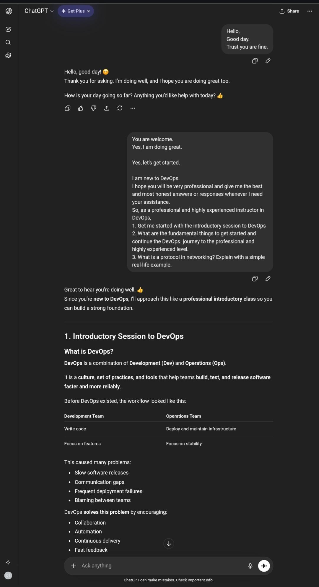
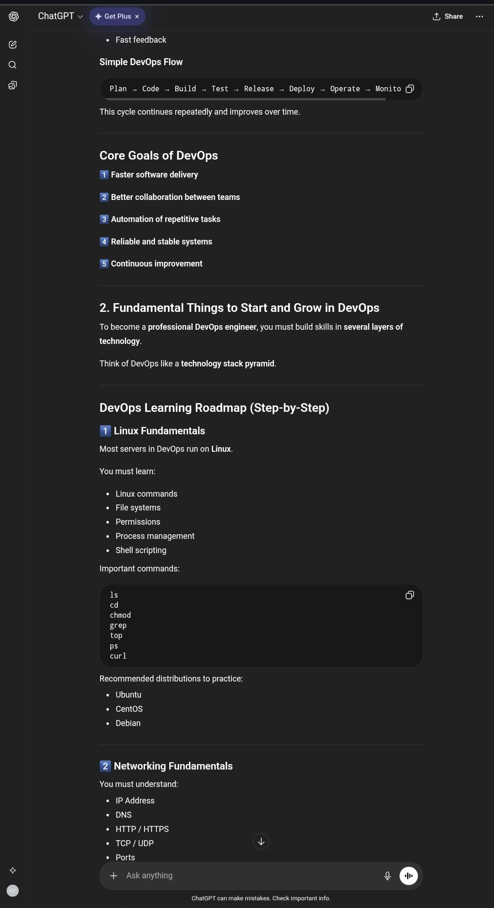
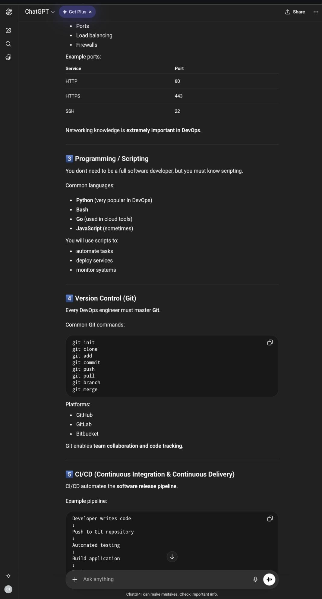
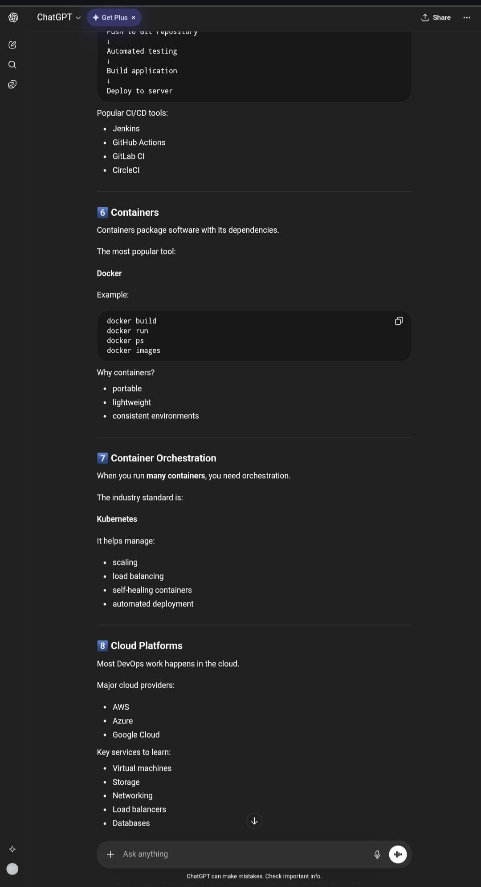
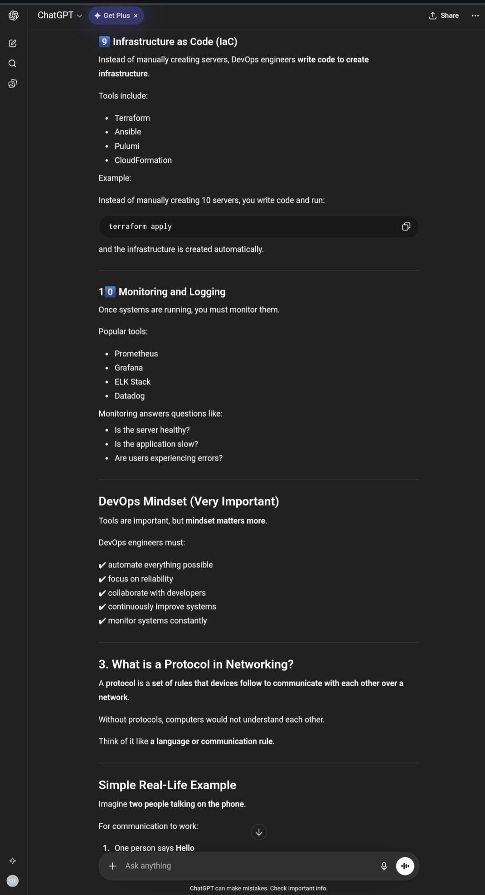
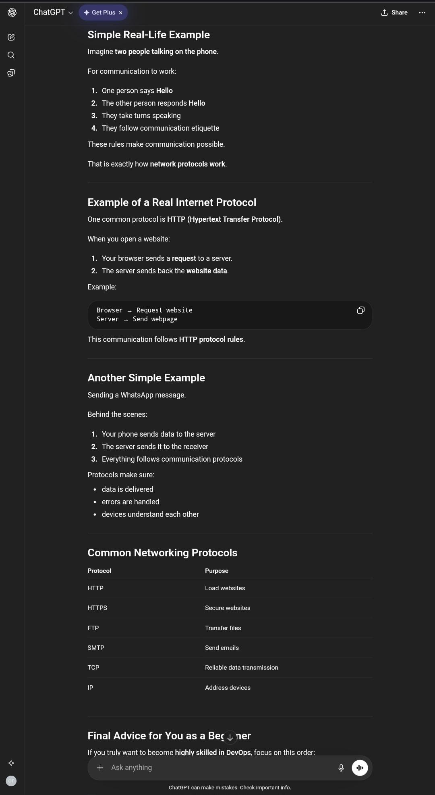
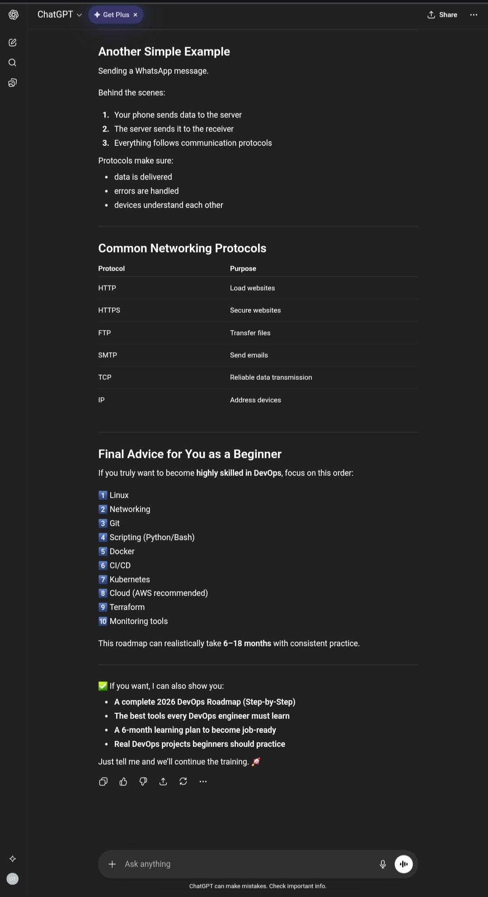
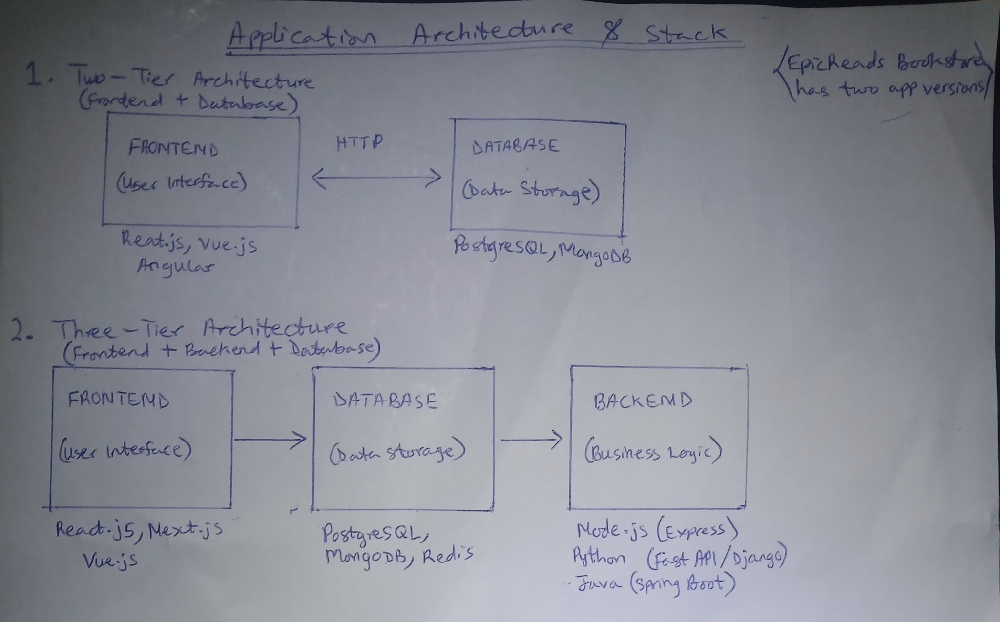
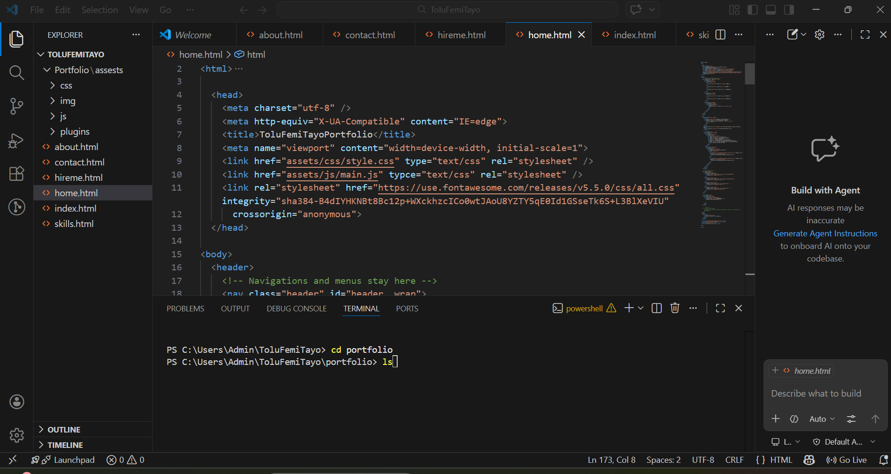

# Week 00 - Internet and Networking

Part of the DevOps Micro Internship (DMI) Cohort 3 with Agentic AI

---

# 🧑‍💻 Task 1: Using ChatGPT as Your Learning Assistant

## Scenario

You're new to DevOps and will frequently encounter technical questions. ChatGPT can be your learning companion.

## Your Task

Write a clear ChatGPT prompt to help you understand:

> "What is a protocol in networking? Explain with a simple real-life example."

Take a screenshot of your interaction showing:

* Your detailed prompt (with clear expectations)
* ChatGPT's simplified response with an example

## Screenshot

Save your screenshot in the `screenshots` folder and update the file name below.










Replace `task-1-chatgpt.png` with your actual screenshot file name.

---

## What I Learned (2–3 lines)

I have learned that DevOps focuses on collaboration, automation, and using tools to build and deploy applications efficiently. Using ChatGPT as a learning assistant helps me break down these complex concepts (like networking protocols) into simple, real-life explanations. This makes it easier for me as a beginner to understand core areas like networking, which are necessary for succeeding in my DevOps journey. 

---

# 🌐 Task 2: Internet and Networking

## Scenario

Your friend is launching an online bookstore named **EpicReads**.

He asked you to explain how users globally can access his website hosted in Finland.

## Your Task

Write a short explanation (**100–150 words**) that includes:

* Packet Switching
* IP Address
* TCP/IP
* HTTP/HTTPS

💡 **Tip:** You may use ChatGPT (as demonstrated in Task 1) to refine your explanation.

## Answer

How Users Worldwide Access EpicReads
Imagine EpicReads is a physical store in Finland. For global customers to visit digitally, say someone types EpicReads.com in his browser, here's what happens:
The browser first asks, "Where is epicreads.com?" A special server called DNS finds EpicReads website's IP address - a device's unique number that identifies EpicReads in Finland. This acts as the store's exact internet street address. 
The browser then sends a request using HTTP/ HTTPS - a secure language guaranteeing safe communication. This request is broken into tiny pieces called packets through a process called packet switching.
These packets travel across the internet through many networks using the TCP/IP protocol - a rulebook. TCP makes sure all packets arrive safely and in order, while IP handles the routing.
The Finnish server receives the packets, processes the request, and sends the website back the same way. 
When all the pieces reach the customer’s screen, they instantly snap back together. All of this happens in just seconds!
This is how the internet connects people globally and can buy from EpicReads - by breaking data into packets, routing them efficiently, and reassembling them at the destination.

---

# 🏗️ Task 3: Application Architecture & Stack

## Scenario

EpicReads bookstore has two application versions:

### Two-Tier Application

* Frontend
* Database

### Three-Tier Application

* Frontend
* Backend
* Database

## Your Task

* Draw simple diagrams (hand-drawn or tool-based such as draw.io)
* Label each layer clearly
* List at least two common technologies or tools used for each layer
* Submit a screenshot or photo clearly showing your own drawing

## Diagram Screenshot / Photo

Save your diagram image in the `screenshots` folder and update the file name below.




Replace `task-3-diagram.png` with your actual diagram file name.

---

## Technologies Used

### Frontend

React.js, Vue.js, Next.js Flutter 
React.js, Next.js, SvelteKit 

### Backend

Node.js (Express),Python (FastAPI), Go, 
Java (Sprint Boot)

### Database

PostgreSQL (RDS), MongoDB (Atlas), Redis
PostgreSQL, MySQL, Firebase, MongoDB 

---

# 🌍 Task 4: Domain Name & DNS (Basic Concepts)

## Scenario

Your friend's bookstore **EpicReads** is currently accessible through:

```text
52.172.142.222:3000
```

He purchased the domain:

```text
epicreads.com
```

## Your Task

In **50–100 words**, explain in your own words:

1. What is DNS (Domain Name System)?
2. Which DNS record type should be used to connect the domain to the given IP, and why?

## Answer

Domain Name System (DNS) is the internet's phonebook, which translates domain names (like epicreads.com) into the actual machine addresses (IP, like 52.172.142.222) that computers understand. Computers can easily locate themselves online with this translation. Users would have to type long IP addresses whenever they want to visit a website if not for the existence of DNS. Instead of long numbers, users use names and DNS direct requests correctly. 
To connect epicreads.com to 52.172.142.222, an A record is used as it maps a domain to an IPv4 address. We should note that DNS does not handle the port (:3000). Port must be handled separately (e.g. via reverse proxy or changing the app port).

---

# 💻 Task 5: Visual Studio Code Setup (Hands-on)

## Your Task

Install Visual Studio Code (if not already installed).

Take a screenshot of your VS Code environment showing:

* Terminal open inside VS Code
* Running a basic command:

### Windows

```powershell
dir
```

### Linux / macOS

```bash
pwd
ls
```

* Your selected VS Code theme clearly visible

⚠️ **Important:** The screenshot must show your username or another identifiable detail to confirm it is your environment.

## Screenshot

Save your screenshot in the `screenshots` folder and update the file name below.




Replace `task-5-vscode.png` with your actual screenshot file name.

---

# 🔗 Task 6: Publish Your Assignment as a LinkedIn Post

## Objective

Publishing on LinkedIn helps you:

* Build your professional online presence
* Reinforce your learning
* Document your DevOps journey publicly

## Your Task

Summarize your answers from Tasks 1–5 into a LinkedIn post.

Clearly structure your post into the following sections:

* ChatGPT
* Internet & Networking
* App Architecture
* DNS
* VS Code Setup

Add the following credit note at the end of your post:

> **P.S. This post is part of the DevOps Micro Internship (DMI) with Agentic AI — Cohort 3 — by Pravin Mishra. My graded progress is public: https://dmi.pravinmishra.com/s/ToluFemiTayo.html · Start your DevOps journey: https://dmi.pravinmishra.com/?utm_source=student&utm_medium=ps-linkedin&utm_campaign=cohort3**

---

## LinkedIn Post URL

https://www.linkedin.com/feed/update/urn:li:activity:7476601273061031937/

Blog / Medium: https://medium.com/p/16acc233a9a0?postPublishedType=initial

```text
www.linkedin.com/in/omodara-tolulope-136262158
```

---

## LinkedIn Post Backup Copy

I am very excited and happy to start DevOps Micro Internship with Agentic AI Cohort 3 (DMI-C3) today. 

I am ready to be committed to this for the next 5 months.

Starting the DevOps Micro Internship Cohort 3 journey, I found it relatively easy to understand the introductory concepts like what DevOps is, basic application architecture, the use of AI assistant agent to break down complex concepts and setting up tools like VS Code. However, it was challenging to fully grasp how networking concepts and different DevOps practices connect together as a complete workflow.

Next week, I plan to take things more gradually, revisit the difficult topics, and focus on new week's lessons to build a stronger foundation.


P.S. This post is part of the DevOps Micro Internship (DMI) with Agentic AI — Cohort 3 — by Pravin Mishra. My graded progress is public: https://dmi.pravinmishra.com/s/ToluFemiTayo.html · Start your DevOps journey: https://dmi.pravinmishra.com/?utm_source=student&utm_medium=ps-linkedin&utm_campaign=cohort3

---

# Reflection – Week 0

### What did you find easy?

Starting the DevOps Micro Internship Cohort 3 journey, I found it relatively easy to understand the introductory concepts like what DevOps is, basic application architecture, the use of AI assistant agent to break down complex concepts and setting up tools like VS Code. 

---

### What was difficult?

However, it was challenging to fully grasp how networking concepts and different DevOps practices connect together as a complete workflow.

---

### What will you improve next week?

Next week, I plan to take things more gradually, revisit the difficult topics, and focus on new week's lessons to build a stronger foundation.

---

## 📌 About DMI & CloudAdvisory

DevOps Micro Internship (DMI) is a project-based DevOps program run by Pravin Mishra (The CloudAdvisory) focused on real-world execution, systems thinking, and career readiness.

It helps learners build strong DevOps foundations with hands-on experience.


## 📌 Resources

- 🌐 **DMI Official Website:** https://pravinmishra.com/dmi  
- 🎓 **DevOps for Beginners (Udemy):** https://www.udemy.com/course/devops-for-beginners-docker-k8s-cloud-cicd-4-projects/  
- 🎓 **Ultimate Agentic AI DevOps with Clude Code** https://www.udemy.com/course/ultimate-agentic-ai-devops-with-claude-code/?referralCode=448389767BC96284087B
- 🎓 **DevOps with Claude Code: Terraform, EKS, ArgoCD & Helm** https://www.udemy.com/course/devops-with-claude-code-terraform-eks-argocd-helm/?referralCode=1C5B734505D65A010FA3
- ▶️ **YouTube Playlist (DMI Cohort 3):** https://www.youtube.com/playlist?list=PLFeSNDtI4Cho  
- 🔗 **Pravin Mishra (LinkedIn):** https://www.linkedin.com/in/pravin-mishra-aws-trainer/  
- 🏢 **CloudAdvisory (LinkedIn):** https://www.linkedin.com/company/thecloudadvisory/

---

*This submission is part of DevOps Micro Internship (DMI) Cohort 3 — Agentic AI Track*